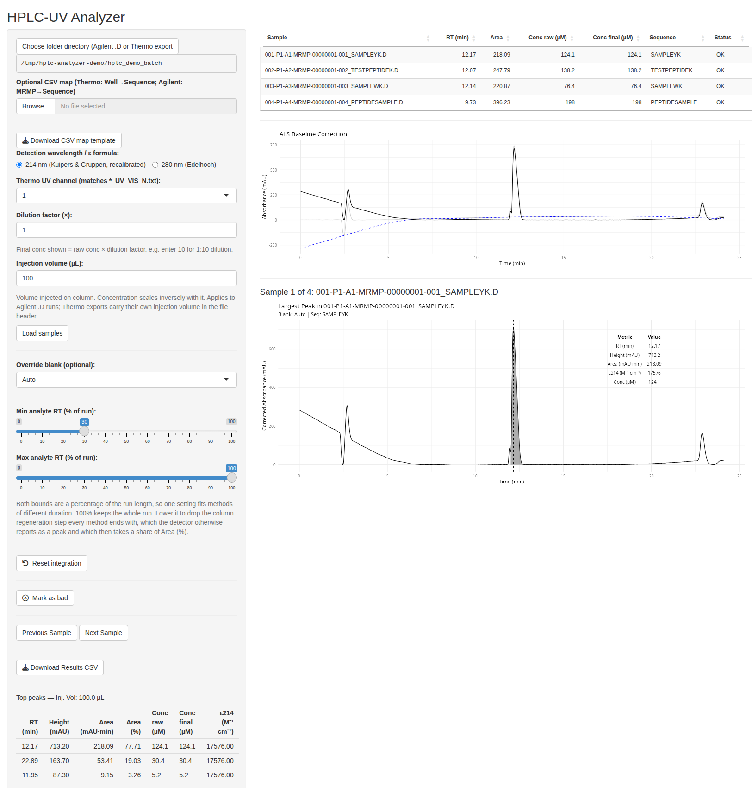
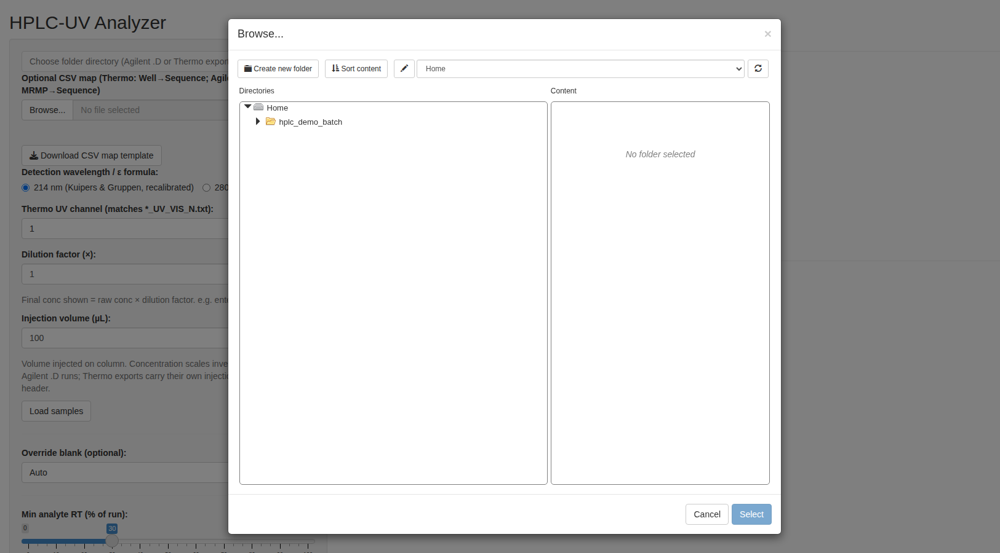
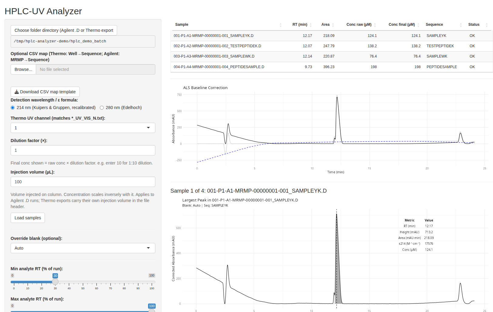
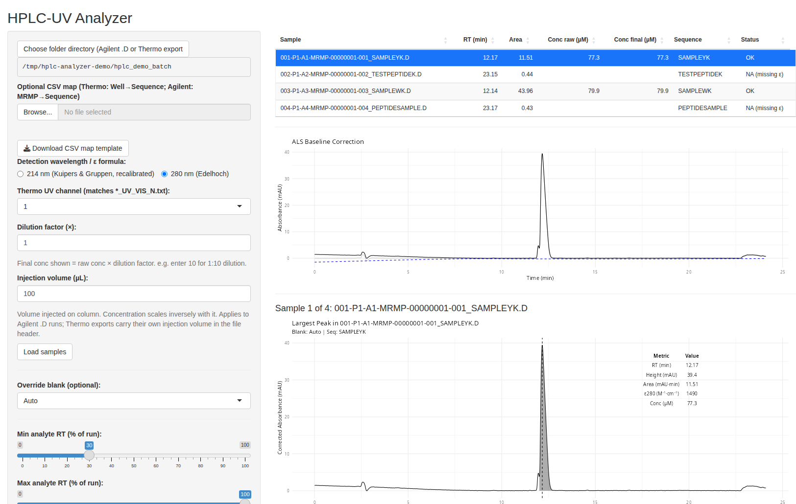
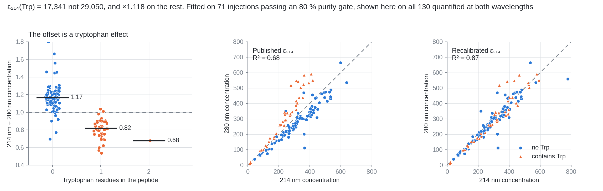
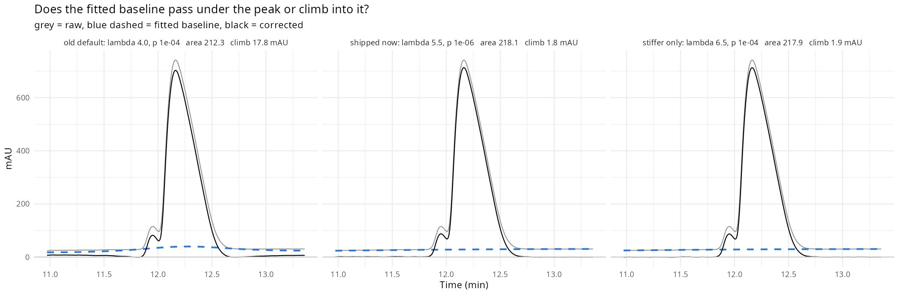

# hplcAnalyzer

[](https://www.gnu.org/licenses/gpl-3.0)
[](https://www.r-project.org/)

hplcAnalyzer turns a peptide HPLC-UV chromatogram into a concentration and a purity number
without a standard curve. It reads the raw instrument files, corrects the baseline, integrates
the peaks, and converts the main peak area to molarity using a molar absorptivity predicted
from the peptide sequence. Everything runs locally, either from the R console or from a Shiny
app aimed at bench chemists rather than R programmers.

Version 0.5.1. See [NEWS.md](NEWS.md) for the version history.



---

## What you can do with it

Three things people actually use this for. Each is a complete recipe; the walkthrough below
shows the clicks.

### 1. Purity of a synthesis batch, no sequences required

You have sixty `.D` folders off the prep queue and you need a percent-purity number for each.
Point the app at the folder, click **Load samples**, read the **Area (%)** column of the peak
table, download the CSV. Purity is an area ratio, so it needs no extinction coefficient and no
sequence: it works even for peptides the app cannot quantify. Set **Max analyte RT** to 80
percent first, or the column regeneration step at the end of the run counts as a peak and
eats into the denominator.

### 2. Concentration without a standard curve

You need micromolar for each peptide, to normalise a set of stocks. Same batch, but now every
run needs a sequence, which the app resolves from the folder name, `SAMPLE.XML`, or a CSV map
you upload. Set the injection volume if the method is not 100 microlitres. Read **Conc final
(µM)**. There is no calibrant anywhere in this: the absorptivity is predicted from the
sequence, so one injection per peptide is enough.

### 3. Cross-check a suspect number at a second wavelength

A concentration looks wrong and you want a second opinion that does not involve running
anything again. If the peptide contains a tryptophan or a tyrosine, switch the wavelength to
280 nm and re-load: the same injection is quantified through a completely different
chromophore and a different absorptivity model. On the batches behind
[Recalibration of eps214](#recalibration-of-eps214) the two channels agree to a median of 8
percent, so a peptide where they disagree by 30 percent is telling you something. Peptides
with neither Trp nor Tyr return `NA (missing ε)` at 280 nm, by design, and cannot be
cross-checked this way.

---

## Supported input

| Instrument | Files read | Reader |
|---|---|---|
| Agilent ChemStation | a folder of `.D` acquisition folders | `read_hplc_agilent()`, via `chromConverter` |
| Thermo / Chromeleon | `*_UV_VIS_N.txt` UV text exports | `read_hplc_thermo()` |

Both readers are found automatically in whichever folder you point the app at. Agilent `.D`
folders are picked up as immediate subdirectories; Thermo exports are picked up as files
directly inside the folder. Neither search recurses.

**A real wavelength choice exists for Agilent only.** For an Agilent `.D` folder,
`read_hplc_agilent()` searches the DAD signals for one whose `detector_range` attribute
matches both the requested signal wavelength and the reference wavelength, so asking for
280 nm genuinely extracts the 280 nm trace. The Thermo reader has no wavelength concept at
all: `read_hplc_thermo(file)` takes a path and nothing else, and the app's "Thermo UV channel"
control selects a **file number** (`N` in `*_UV_VIS_N.txt`), not a wavelength. On the Thermo
path the wavelength radio button therefore only chooses which epsilon formula is applied to
whatever trace the channel number pulled in.

---

## Installation

The package is pure R. No compiler, and no Rtools on Windows, is needed for hplcAnalyzer
itself, though some of its CRAN dependencies compile from source on Linux.

`DESCRIPTION` declares no minimum R version, but `chromConverter`, `dplyr` and `ggplot2` all
require **R 4.1 or newer**, so that is the effective floor. Developed and tested on R 4.5.2.

### Step by step, from nothing to a running app

**1. Install R.** hplcAnalyzer needs R 4.1 or newer; 4.5 is what it is developed on.

| Platform | How |
|---|---|
| **macOS** | Download the `.pkg` from [cran.r-project.org/bin/macosx](https://cran.r-project.org/bin/macosx/). Take the **arm64** build on Apple Silicon (M1 and later) and the **x86_64** build on Intel. Double click, accept the defaults. |
| **Windows** | Download the installer from [cran.r-project.org/bin/windows/base](https://cran.r-project.org/bin/windows/base/). Accept the defaults. Rtools is **not** needed. |
| **Ubuntu / Debian** | `sudo apt update && sudo apt install r-base r-base-dev`. The `-dev` package matters: several CRAN dependencies compile from source on Linux. |

RStudio is optional and changes nothing here. If you use it, install it after R.

**2. Get the code.** Either clone it:

```bash
git clone git@github.com:PitKubi/hplc_analyzer.git
cd hplc_analyzer
```

or download the ZIP from the repository's green **Code** button and unzip it. On macOS the
unzipped folder lands in `~/Downloads/hplc_analyzer-main`; `cd` there.

**3. Install the package and everything it needs, in one command:**

```bash
Rscript install.R
```

Expect five to fifteen minutes on a first run, longer on Linux where packages compile. It is
safe to re-run; anything already present is skipped.

**4. Start the app.**

```bash
Rscript -e 'hplcAnalyzer::run_hplc_app()'
```

Your browser opens on the app. Leave the terminal window open, it is the server. Ctrl-C in
that terminal stops it.

**If step 3 fails**, the usual cause on macOS is a package that wants to compile. Force binary
installs and try again:

```r
options(pkgType = "binary")
source("install.R")
```

On Ubuntu a compile failure usually names a missing system library. `sudo apt install
libcurl4-openssl-dev libssl-dev libxml2-dev libfontconfig1-dev` covers the ones these
dependencies ask for.

### From a git checkout, the short version

```bash
git clone git@github.com:PitKubi/hplc_analyzer.git
cd hplc_analyzer
Rscript install.R
```

`install.R` reads the dependency list out of `DESCRIPTION`, installs from CRAN whatever is
missing, then installs the package from the working tree. It is written in base R so that a
machine with nothing but R on it can run it. It also works from inside R or RStudio:

```r
setwd("/path/to/hplc_analyzer")
source("install.R")
```

### Directly from GitHub

If the repository is public, this is all it takes:

```r
install.packages("remotes")
remotes::install_github("PitKubi/hplc_analyzer")
```

**While it is private**, that call fails with a 404 rather than a 403, because GitHub hides
private repositories rather than refusing them. Use a personal access token with the `repo`
scope:

```r
install.packages("remotes")
remotes::install_github("PitKubi/hplc_analyzer",
                        auth_token = Sys.getenv("GITHUB_PAT"))
```

Put the token in `~/.Renviron` as `GITHUB_PAT=ghp_...` rather than typing it into a script.
Never commit it.

Note the repository is named `hplc_analyzer` while the package is named `hplcAnalyzer`.

### As a source tarball

This is how the package currently reaches collaborators on macOS and Windows. Build it once
on any machine:

```bash
cd hplc_analyzer
R CMD build .
```

That writes `hplcAnalyzer_0.5.1.tar.gz`. Send that file. The recipient installs the CRAN
dependencies once and then the tarball:

```r
install.packages(c("chromConverter","dplyr","baseline","signal","pracma","ggplot2",
                   "gridExtra","shiny","shinyFiles","fs","DT","tibble","xml2","magrittr"))
install.packages("C:/path/to/hplcAnalyzer_0.5.1.tar.gz", repos = NULL, type = "source")
```

On Windows, close and reopen R before installing over an existing version. A loaded package
cannot be overwritten and the install fails quietly. Check what you ended up with:

```r
packageVersion("hplcAnalyzer")
```

`INSTALL.md` carries the same instructions in a longer, step by step form for users who are
new to R.

---

## Walkthrough

```r
library(hplcAnalyzer)
run_hplc_app()
```

The app opens in your browser. Nothing leaves your machine: there is no upload, no account and
no network call anywhere in the package.

The run shown below is a real Agilent batch of four peptide injections. The peptide names are
synthetic, so the numbers belong to the sequences on screen rather than to anyone's samples.
There is no blank in this folder, so the screenshots show the plain ALS baseline path; see
[the blank-subtracting path leaves an injector artefact](#the-blank-subtracting-path-leaves-an-injector-artefact)
for what changes when a blank is present.

**Step 1. Point it at a folder.** Click **Choose folder directory** and pick the folder that
holds your `.D` folders, or your `*_UV_VIS_N.txt` exports. Pick the folder itself, not one of
the `.D` folders inside it.



**Step 2. Set the wavelength and the injection volume, then load.** 214 nm is the default and
is the one that works for every peptide. For Agilent, set the injection volume if the method
is not 100 microlitres, because concentration scales inversely with it. Then click
**Load samples**: every run is analysed once and the table fills in.



Each row carries the retention time and area of the main peak, the concentration before and
after the dilution factor, the sequence that was resolved, and a status. A blank, if one is
present in the folder, is detected and used rather than listed as a sample.

**Step 3. Inspect one run.** Click a row, or use **Previous** and **Next**. The upper plot
shows the raw trace, the fitted baseline and the corrected trace, so you can see what the
baseline correction did rather than trust it. The lower plot shows the corrected trace with
the integrated peak shaded and the numbers that produced the concentration, including the
epsilon actually used. The sidebar fills with the top ten peaks and their **Area (%)**.


**Step 4. Cross-check at 280 nm, where the peptide allows it.** Switch the wavelength and
click **Load samples** again. Peptides carrying a tryptophan or a tyrosine are quantified
through a second, independent chromophore. Peptides carrying neither return `NA (missing ε)`
and say so in plain words rather than reporting a number that would be meaningless.



In this batch, `SAMPLEYK` and `SAMPLEWK` quantify at both wavelengths; `TESTPEPTIDEK` and
`PEPTIDESAMPLE` have no 280 nm chromophore at all. That split is not a failure, it is the
reason 214 nm is the default: only about a third of tryptic peptides carry Trp or Tyr. Note how
much smaller the 280 nm signal is: 11.51 mAU-min of peak area against 218.09 at 214 nm on
the same injection.

**Step 5. Download the results.** **Download Results CSV** writes one row per run; the columns
are listed under [Results CSV columns](#results-csv-columns).

### Scripted use

```r
library(hplcAnalyzer)

result <- run_hplc_analysis_agilent(
  sample_d_path     = "batch/004-P2-A1-MRMP-00000001-001_SAMPLEPEPTIDEK.D",
  blank_d_path      = "batch/003-1-BLANK0.D",
  peptide_sequence  = "SAMPLEPEPTIDEK",
  use_hybrid        = TRUE,
  signal_wavelength = 214,
  inj_vol_ml        = 0.1,
  min_rt_frac       = 0.30,
  max_rt_frac       = 0.80
)

result$peak_table        # one row per detected peak
result$epsilon           # molar absorptivity used, M^-1 cm^-1
result$concentration_uM  # main peak concentration, micromolar
result$plot              # annotated ggplot
main_peak_area_percent(result$peak_table)   # purity, percent
```

`run_hplc_analysis_thermo()` takes `sample_file` instead of `sample_d_path` and accepts no
blank.

---

## The analysis chain

Both pipelines run the same steps in the same order.

1. **Read.** `read_hplc_agilent()` or `read_hplc_thermo()` returns a data frame of `time`
   (min) and `intensity` (mAU). The Agilent reader also parses the injection volume out of
   `acq.txt` and stamps it on the frame as the `inj_vol_ml` attribute.
2. **Baseline correction.**
   - `baseline_als()` fits an asymmetric least squares baseline to the whole trace and
     subtracts it. This is the default and the only path at 280 nm.
   - `align_subtract_then_hybrid()` is the blank-subtracting path, used at 214 nm when a
     blank run is available. It aligns the blank to the sample on the injector peak midpoint,
     subtracts it only after the injector window, bridges the positive/negative artefact pairs
     that over-subtraction creates, then calls `baseline_hybrid_sm()` to fit piecewise ALS
     baselines between the minima of the difference trace. A one minute guard ramps the
     baseline up from zero just after the injector so the subtraction does not open with a dip.
   - Thermo exports are taken as already baseline corrected by the instrument, so `corrected`
     is set equal to `intensity`.
3. **Peak detection.** `detect_peaks_on_smoothed()` smooths the corrected trace with a
   Savitzky-Golay filter (11 point window, 3rd order by default), estimates the noise as the
   standard deviation of the first 50 points, and calls `pracma::findpeaks()` with a threshold
   of `snr` times that noise (default 5). Peaks outside the analyte retention time window are
   dropped.
4. **Area.** Trapezoidal integration (`pracma::trapz()`) between the peak start and end indices
   that `findpeaks()` reports, on the smoothed trace. Units are mAU times min.
5. **Concentration.** `estimate_epsilon_214()` or `estimate_epsilon_280()` predicts the molar
   absorptivity from the sequence, and `calculate_peak_conc()` applies Beer-Lambert.

`filter_top_peaks()` ranks peaks by height and keeps the top ten; `peak_area_percent()` and
`main_peak_area_percent()` turn that ranked set into the Area (%) purity column.

---

## The science

### Molar absorptivity at 214 nm

Two functions cover 214 nm. `published_epsilon_214()` is the literature model, untouched.
`estimate_epsilon_214()` is what the pipelines and the app actually call, and it applies a
recalibration measured on our own data; see [Recalibration of eps214](#recalibration-of-eps214)
below for what changed, why, and how to change it back.

`published_epsilon_214()` implements the additive residue model of

> Kuipers, B. J. H. and Gruppen, H. (2007). Prediction of molar extinction coefficients of
> proteins and peptides using UV absorption of the constituent amino acids at 214 nm to enable
> quantitative reverse phase high-performance liquid chromatography-mass spectrometry analysis.
> *Journal of Agricultural and Food Chemistry* **55**(14), 5445-5451.

At 214 nm the peptide bond itself is the dominant chromophore, so absorptivity is built up
term by term rather than from aromatic residues alone:

- **923** M<sup>-1</sup> cm<sup>-1</sup> per peptide bond, that is `nchar(sequence) - 1` bonds.
- **2675** M<sup>-1</sup> cm<sup>-1</sup> per proline that is **not** N-terminal. Proline is
  deliberately absent from the per-residue table below and carried by this term instead.
- Per-residue contributions, summed over the sequence:

  | Residue | eps | Residue | eps | Residue | eps | Residue | eps |
  |---|---|---|---|---|---|---|---|
  | W | 29050* | H | 5125 | N | 136 | K | 41 |
  | Y | 5375 | M | 980 | C | 225 | T | 41 |
  | F | 5200 | R | 102 | G | 21 | E | 78 |
  | Q | 142 | V | 43 | I | 45 | L | 45 |
  | A | 32 | S | 34 | D | 58 | | |

  \* Tryptophan is the one value `estimate_epsilon_214()` does not use as printed. See
  [Recalibration of eps214](#recalibration-of-eps214).

- Four tripeptides are special-cased to the measured values from the paper's Table 3 and
  bypass the additive model entirely: GGG 1080, GPG 3620, PGG 950, GGP 3880. They carry no
  tryptophan, so the recalibration scales them like any other tryptophan-free peptide.

Both functions return `NA` for anything that is not a string of the twenty standard one-letter
codes, so blanks, washes and unresolved sequences fall through cleanly.

### Recalibration of eps214

**The tryptophan term shipped here is not the published one.** `estimate_epsilon_214()` returns

```
NON_TRYPTOPHAN_EPSILON_214_SCALE * (published - 29050 * nTrp)  +  MEASURED_TRYPTOPHAN_EPSILON_214 * nTrp
```

with `MEASURED_TRYPTOPHAN_EPSILON_214 = 17340` and `NON_TRYPTOPHAN_EPSILON_214_SCALE = 1.118`.
Both constants sit at the top of `R/estimate_epsilon_214.R`, and the same two numbers appear in
`peptide-calculator/src/calculations.js`. Change them together or the desktop calculator and the
Shiny app will disagree.



**Where the numbers come from.** A peptide measured at both 214 and 280 nm gives two independent
concentrations from one injection, so sample amount, dilution and any whole-batch offset cancel in
their ratio and what is left is the extinction model. On 130 such injections that ratio tracks
tryptophan and nothing else, at rho = -0.76, p < 1e-13: median 1.17 with no tryptophan, 0.82 with
one, 0.68 with two. Tyrosine, phenylalanine, histidine, methionine and peptide length add nothing.

A reported concentration is inversely proportional to the extinction coefficient used, so the
coefficient a peptide would have needed is its published value times that ratio. Fitting one
replacement tryptophan term and one scale on everything else, by least squares over the 71
injections passing an 80 percent purity gate, with a 4000-draw bootstrap:

| Parameter | Fitted | 95 % CI | Published |
|---|---|---|---|
| eps214 tryptophan | 17,340 | 14,519 to 19,569 | 29,050 |
| scale on the rest | 1.118 | 1.01 to 1.26 | 1 |

Tyrosine and phenylalanine, freed in the same fit, come back at 5,080 and 3,813 with intervals
covering their published 5,375 and 5,200, so they are left alone.

**Why it is believable.** Fitting each batch separately gives 15,300 and 18,200 for the tryptophan
term, so it is not one batch misbehaving. Amino acid analysis, which is not used in the fit at all,
agrees independently: tryptophan drags the 214 nm channel away from it while the 280 nm channel
stays put. And the correction closes that gap too, from 26 to 11 percentage points in one batch and
20 to 7 in the other.

**What it buys.** Across the 130 injections, 214 nm against 280 nm improves from R2 0.68 to 0.87,
and the median absolute difference between the two channels, as a percentage of the mean of the
pair, from 17.3 to 8.1 percent. Those are the numbers the shipped constants actually produce, not
the unrounded fit.

**The scale is the soft number.** The tryptophan term is well determined and its interval is
nowhere near 29,050. The 1.118 scale is not: its interval nearly touches 1, and anchored on amino
acid analysis instead, using the 170 tryptophan-free peptides of a clean batch, it comes out 1.078.
Treat 1.08 to 1.12 as the range and set it from a batch you trust. Shipping 1 instead of 1.118
leaves the two channels 15 percent apart, so it is not a safe default; the two parameters belong
together.

**What changes in your numbers.** Concentrations move as `published / calibrated`:

| Peptide | Trp | Published eps | Calibrated eps | Reported concentration |
|---|---|---|---|---|
| `DIAAYIK` | 0 | 11,166 | 12,484 | 10.6 % lower |
| `GSEMVVAGK` | 0 | 8,677 | 9,701 | 10.6 % lower |
| `INEWLTK` | 1 | 34,974 | 23,963 | 45.9 % higher |
| `AWVNQLETQTGEASK` | 1 | 42,878 | 32,800 | 30.7 % higher |

Every tryptophan-free peptide moves by the same 10.6 percent, so purity, `Area (%)` and any
ratio between peptides in one run are unaffected. Only tryptophan peptides change relative to
the rest, and they are the point of the exercise.

**To go back to the literature model**, either call `published_epsilon_214()` directly, or set
`MEASURED_TRYPTOPHAN_EPSILON_214 <- 29050` and `NON_TRYPTOPHAN_EPSILON_214_SCALE <- 1` and
reinstall. `tests/testthat/test-estimate_epsilon_214.R` pins the published model separately, so
it keeps passing either way.

The source data are a collaborator's purity batches and are deliberately not in this
repository. The 2025 batches in `aaa_hplc_compare/` are the same comparison run earlier, kept
here in anonymised form; see the README in that folder.

### Molar absorptivity at 280 nm

`estimate_epsilon_280()` implements the Edelhoch method as revised by

> Pace, C. N., Vajdos, F., Fee, L., Grimsley, G. and Gray, T. (1995). How to measure and
> predict the molar absorption coefficient of a protein. *Protein Science* **4**(11),
> 2411-2423.

```
eps280 = 5500 * nTrp + 1490 * nTyr
```

Two things about this matter more than anything else in the package:

- **Cystine is not included.** The full Pace formula adds 125 M<sup>-1</sup> cm<sup>-1</sup>
  per disulfide bond. The disulfide state of a synthetic purity-check peptide is not known
  from its sequence, so this implementation assumes all cysteines are free and contributes
  nothing for them.
- **A peptide with no Trp and no Tyr returns `NA`, and cannot be quantified at 280 nm at all.**
  There is no chromophore, so there is no concentration to compute, and the app says
  `NA (missing eps)` rather than showing a number. In one production batch of 47 distinct
  peptides, **25 had neither Trp nor Tyr**, so more than half the plate is unquantifiable at
  280 nm. Use 214 nm unless you have a specific reason not to.

For those peptides the Area (%) purity column still works, because purity is a ratio of two
areas and needs no absorptivity.

### Area to concentration

`calculate_peak_conc()` is Beer-Lambert with the units cancelled explicitly:

```
c [M] = (area [mAU*min] * flow [mL/min] / 1000) / (eps [M^-1 cm^-1] * pathlength [cm] * V_inj [mL])
```

The chain of units is:

1. `area * flow` gives mAU times mL, the total absorbance-volume swept through the cell.
2. Dividing by 1000 converts mAU to AU, giving AU times mL.
3. Dividing by `eps * pathlength` converts absorbance to molarity, leaving mol/L times mL.
4. Dividing by the injection volume in mL cancels the mL and leaves mol/L.

The result is multiplied by 1e6 for the reported micromolar value. Defaults are 1 mL/min flow
and 1 cm pathlength; neither is exposed in the app, so change them in a script if your method
differs.

---

## Worked data cases

Two datasets have been used to test this package against an independent method. Both are
peptide purity batches measured twice, once by amino acid analysis and once by this package
from the UV chromatogram.

### Case 1: what a tryptophan does to a 214 nm number

130 injections quantified at both 214 and 280 nm. Because both numbers come from the same
injection, everything about the sample cancels in their ratio and only the extinction model
survives. The ratio turned out to depend on one residue and nothing else.


Left panel: the 214-to-280 ratio against tryptophan count, median 1.17 with none, 0.82 with
one, 0.68 with two, rho = -0.76. Middle: the two channels against each other on the published
coefficients, tryptophan peptides in orange sitting well off the line. Right: the same data
after refitting the tryptophan term to 17,340 and scaling the rest by 1.118. R2 goes from 0.68
to 0.87 and the median absolute difference between channels from 17.3 to 8.1 percent. The
argument, the intervals and how to change the constants are in
[Recalibration of eps214](#recalibration-of-eps214).

### Case 2: four batches against amino acid analysis

`aaa_hplc_compare/` holds the earlier comparison: 352 injections across four 2025 batches,
UV against amino acid analysis, in anonymised form. See
[its README](aaa_hplc_compare/README.md) for the columns.

| Batch | n | median UV / AAA | R2 | Lin's concordance |
|---|---|---|---|---|
| 2025-01 | 52 | 1.16 | 0.17 | 0.34 |
| 2025-04 | 110 | 1.06 | 0.20 | 0.44 |
| 2025-05 | 124 | 1.02 | 0.57 | 0.74 |
| 2025-06 | 66 | 0.94 | 0.64 | 0.80 |

Two things to take from it. **Each batch carries its own scale factor**, spanning 0.94 to 1.16
here, so agreement should be judged within a batch rather than pooled across batches. And the
reference is not the fixed point it looks like: **the reported amino acid analysis replicate
CV in this dataset has a median of 13.5 percent** (interquartile 11.1 to 16.5), which is most
of the spread you see in `scatter_by_batch.png`. A UV number that sits 15 percent from an AAA
number is inside the reference method's own noise.

Not one of these four batches contained a tryptophan peptide, which is exactly why the problem
in case 1 stayed invisible until 2026.

---

## Behaviour that will surprise you

### The baseline is tuned to pass under the peak, not through it

The global ALS baseline runs at **lambda 5.5, p 1e-6**. Those two numbers were tuned together
by looking at the fit through the main peak on 20 runs, not by eye on one:



Left is the original setting. The fitted baseline visibly climbs under the peak and takes area
with it, a median of 10.0 mAU above its own level 1.5 min either side of the apex. Middle is
what ships now, 1.1 mAU, the lowest of the grid tested. Right shows that stiffening lambda
alone reaches a similar climb but pays for it elsewhere: the corrected trace then needs 9.6 min
to settle back to zero after the injector rather than 6.5, and sits 1.6 mAU off zero between
peaks rather than 0.6.

Both are exposed as `sample_als_lambda` and `sample_als_p` on the scripted interface if a
method needs something else. The piecewise baseline on the blank-subtracting path has its own
pair, `hybrid_als_lambda` and `hybrid_als_p`.

### The blank-subtracting path leaves an injector artefact

At 214 nm, when a blank is present in the folder, the app takes the blank-subtracting hybrid
path. That path leaves a **negative excursion of about -317 mAU at 3.28 minutes**, and it is
the same size and at the same time in every run: measured across a production batch it varies
by less than 2 mAU. It is the blank's own injector peak, over-subtracted, and the one minute
guard ramp in `align_subtract_then_hybrid()` does not reach it. Without a blank, the plain ALS
path leaves **-1.6 mAU** in the same place.

It does not corrupt the reported concentration, because it sits well before the analyte window
that `min_rt_frac` opens at 30 percent of the run, and no peak is picked there. But the two
paths do not agree: on three runs the hybrid path returned 92.9, 44.8 and 91.5 uM where ALS
returned 88.6, 39.0 and 79.5, so a difference of 5 to 15 percent, and it is the hybrid number
that is biased high against hand integration (see the 280 nm entry below).

If a chromatogram in your batch opens with a deep dip just after the injector, that is this,
not your sample. Removing the blank from the folder, or calling
`run_hplc_analysis_agilent(..., use_hybrid = FALSE)`, avoids it.

**At 280 nm the blank is never subtracted, even if you ask for it.**
`run_hplc_analysis_agilent()` computes `use_hybrid && signal_wavelength != 280`, so an explicit
`use_hybrid = TRUE` is overridden at 280 nm. The reason is that there is nothing there to
subtract and the subtraction does harm. Measured over the eight blank runs of a production
batch, between 3 and 18 minutes, the blank baseline drifts about **2.8 mAU/min at 214 nm but
about 0.011 mAU/min at 280 nm**, some 250 times less. Against hand-integrated areas on eight
well-resolved peaks during development, the hybrid path came out biased high on every one
(median +6.6 percent, worst +12.2 percent) while ALS alone stayed within 2.6 percent. The
override is unconditional rather than a changed default because the app sets `use_hybrid` from
"a blank folder exists in this batch", which is a fact about the plate layout and not a
scientific judgement.

**The peptide sequence is resolved from three places, in order.** The uploaded CSV map wins,
then `SAMPLE.XML` inside the `.D` folder, then the folder name. ChemStation truncates the
folder name at 40 characters, and it also caps the `<Name>` element in `SAMPLE.XML` at 40
characters. In the production batch tested, the longest folder basename is 42 characters
(40 plus `.D`) and the longest XML name is exactly 40; the XML resolved 57 of 69 runs against
47 for the folder name, was never shorter, and never disagreed. But five names sit at exactly
40 characters, and two of those sequences are visibly cut mid-peptide. For those, an uploaded
CSV map is the only way to get the real sequence in. The **Download CSV map template** button
writes a CSV prefilled with whatever the app resolved, so correcting them means editing two
cells rather than typing the whole plate.

**Area (%) is against the ten peaks shown, not every peak detected.** The denominator in
`peak_area_percent()` is the sum of the ranked peak areas that `filter_top_peaks()` returned,
which is the main peak plus its nine largest impurities. Dividing by every detected peak
instead sounds more rigorous but is not: on a 280 nm trace the detector reports dozens of
sub-mAU baseline features, and including them drags a peptide that is better than 95 percent
pure down to about 59 percent. The ranked set is the population a purity number is actually
about.

**The on-screen peak table also drops anything before 6 minutes.** That 6 minute floor is
absolute and separate from the Min analyte RT slider, which is a percentage. A peak passing
the slider can still be missing from the table if it elutes before 6 minutes.

**In the app, the sidebar injection volume always wins.** The value parsed from `acq.txt` is
used only when a script calls `run_hplc_analysis_agilent(inj_vol_ml = NA)`. The app always
passes the sidebar value, so the file value is never consulted there.

---

## The controls

| Control | What it does |
|---|---|
| Choose folder directory | Picks the batch folder. Agilent `.D` subfolders and Thermo `*_UV_VIS_N.txt` files are both detected. |
| Optional CSV map | Uploads sequence assignments. Highest priority sequence source. |
| Download CSV map template | Writes a CSV prefilled with the sequences the app resolved on its own. |
| Detection wavelength | 214 nm (Kuipers and Gruppen) or 280 nm (Edelhoch). Chooses the extracted trace on Agilent and the epsilon formula on both. |
| Thermo UV channel | The `N` in `*_UV_VIS_N.txt`. A file number, not a wavelength. |
| Dilution factor | Multiplies the reported concentration. Enter 10 for a 1:10 dilution. Non-finite or non-positive values fall back to 1. |
| Injection volume (uL) | Volume injected on column, default 100. Concentration scales inversely with it. Agilent only. |
| Load samples | Analyses every sample in the folder and fills the table. |
| Override blank | Forces one specific `BLANK` folder instead of the nearest preceding one. |
| Min analyte RT (% of run) | Drops peaks before this fraction of the run. Default 30. |
| Max analyte RT (% of run) | Drops peaks after this fraction of the run. Default 100, which keeps everything. |
| Reset integration | Clears the manual window for this sample and un-marks it as bad. |
| Mark as bad | Blanks the concentration for this sample and sets its status to `Marked bad`. |
| Previous / Next Sample | Navigation, synced with the table selection. |
| Download Results CSV | Exports the accumulated results. |

Both retention time bounds are percentages of run length rather than minutes, so one setting
travels across methods of different duration. A single production batch already mixes 20.01
and 24.11 minute runs. If the maximum is set at or below the minimum, both revert to the
defaults rather than reporting "no peaks detected" for the whole plate.

**Manual integration.** Brush horizontally across the lower peak plot to integrate a region by
hand. The metrics box switches to that window's area and concentration and the results row is
replaced. A hand-drawn window reports no Area (%), because it is not one of the ranked peaks
and has no share of their summed area. Click **Reset integration** to return to the detector.

### Results CSV columns

`sample`, `rt`, `height`, `area`, `main_peak_area_pct`, `conc_uM_raw`, `sequence`, `status`,
`dilution_factor`, `conc_uM_final`, `wavelength_nm`.

`status` distinguishes `OK`, `NA (missing eps)`, `Marked bad`, `No peaks detected` and an
error string, so an empty concentration always carries its reason.

### CSV map format

Column names are matched case-insensitively. Agilent runs are keyed on the MRMP id, Thermo
runs on the plate well.

```csv
MRMP,Sequence
MRMP-00000001-001,SAMPLEPEPTIDEK
MRMP-00000001-002,TESTPEPTIDEAK
```

```csv
Well,Peptide Sequence
P1-A1,SAMPLEPEPTIDEK
P1-B1,TESTPEPTIDEAK
```

The template the app writes carries `MRMP`, `Well`, `Sequence` and `Run` so that one file
serves both instruments. Extra columns are ignored.

---

## Recommended settings

| Setting | Recommended | Why |
|---|---|---|
| Detection wavelength | 214 nm | More than half of a typical peptide plate has no Trp or Tyr and cannot be quantified at 280 nm at all. |
| Min analyte RT | 30 percent | The shipped default. Keeps the injector and void region out of the peak table. |
| Max analyte RT | **80 percent** | See below. |
| Injection volume | whatever the method injects | The app does not read it from the file. |

**Why 80 percent for the maximum.** Every method here ends with a column regeneration step at
high organic, and the detector reports that step as a peak like any other. It appears in all
runs including blanks, so it is instrument behaviour and not sample. Re-measured on this
package at 214 nm over the 56 of 57 peptide runs of a production batch that complete, and across the ranked peaks the app actually reports, the latest genuine
analyte peak sits at **74.6 percent** of the run and the next ranked peak at **86.5 percent**. Nothing at all falls in
between, so any cutoff from about 75 to 86 percent separates them with no analyte lost, and 80
percent sits comfortably in the middle. Left at the default of 100 percent, the regeneration
peak is the largest peak on many 280 nm runs and takes a share of Area (%) on all of them.

The default remains 100 percent so that upgrading the package never silently moves a number
that has already been reported. Set it yourself.

---

## Known limitations

- **The Thermo path shares the wavelength control but uses it only for the epsilon formula.**
  Selecting 280 nm while the Thermo channel selector is pointing at a 214 nm export will
  compute an Edelhoch eps280 against a 214 nm trace and report a concentration for it. Nothing
  in the code can detect this, because the Thermo reader never learns what wavelength it read.
- **Two sequences in the production batch tested remain truncated at source**, because
  ChemStation caps the `SAMPLE.XML` name at the same 40 characters as the folder name. Only an
  uploaded CSV map can fix those.
- **The `acq.txt` injection volume parser requires a unit.** The regex demands `uL` or `mL`
  after the number, so an instrument that writes the number alone silently falls back to
  100 uL. The instrument in the batch tested does write the unit and parses correctly, but the
  sidebar control exists so that this is never load bearing.
- **The reference wavelength is fixed at 360 nm in the app.** `read_hplc_agilent()` accepts a
  `signal_ref` argument, but the app never sets it, so a `.D` folder without a `Sig=<wl>,Ref=360`
  signal fails with "No matching DAD signal". Non-injection runs such as standby files fail
  this way by design.
- **Flow rate and pathlength are not exposed in the app**, and default to 1 mL/min and 1 cm.
  A method running at a different flow rate needs the scripted interface.
- **The hybrid baseline path can fail on individual runs.** One of 58 runs in the batch tested
  errors inside `baseline_hybrid_sm()` with `invalid 'times' argument`. The app catches it, and
  the row carries the error text rather than a number.
- **The hybrid baseline path over-subtracts the injector peak**, leaving a constant -317 mAU
  artefact at 3.28 min that the guard ramp does not cover, and returns concentrations 5 to 15
  percent different from the ALS path on the same runs. See
  [the blank-subtracting path leaves an injector artefact](#the-blank-subtracting-path-leaves-an-injector-artefact).
- **The noise estimate is the standard deviation of the first 50 points** of the trace. A run
  whose first 50 points are not baseline will have its detection threshold set wrongly.
- **Test coverage is narrow.** `tests/testthat/` covers the extinction coefficient models and
  the calibration arithmetic, which are the numbers most likely to move. The readers, the
  baseline paths and the peak detection have no tests; they are verified by re-running
  production batches and comparing results.
- **The 214 nm coefficients are ours, not the paper's.** Anyone reproducing a published
  Kuipers and Gruppen number must call `published_epsilon_214()`, not `estimate_epsilon_214()`.
  See [Recalibration of eps214](#recalibration-of-eps214).

---

## Repository layout

```
R/                      package source
inst/shiny/app/app.R    the Shiny front end, launched by run_hplc_app()
man/                    roxygen-generated help pages
man/figures/            screenshots and the calibration figure used by this README
tests/testthat/         tests for the extinction models and the calibration
install.R               dependency and package installer for a fresh clone
INSTALL.md              step by step install guide for users new to R
NEWS.md                 version history
aaa_hplc_compare/       amino acid analysis versus UV-HPLC comparison, anonymised
peptide-calculator/     an Electron desktop peptide calculator, separate from the R package
```

`aaa_hplc_compare/` and `peptide-calculator/` are excluded from the built package by
`.Rbuildignore`.

---

## References

**The absorptivity models**

1. Kuipers, B. J. H. and Gruppen, H. (2007). Prediction of molar extinction coefficients of
   proteins and peptides using UV absorption of the constituent amino acids at 214 nm to
   enable quantitative reverse phase high-performance liquid chromatography-mass spectrometry
   analysis. *Journal of Agricultural and Food Chemistry* **55**(14), 5445-5451.
   [doi:10.1021/jf070337l](https://doi.org/10.1021/jf070337l)
   Source of the additive 214 nm model in `published_epsilon_214()`: 923 per peptide bond,
   2675 per non-N-terminal proline, the per-residue table, and the four special tripeptides.
   Measured in acetonitrile and formic acid, which is why it suits RP-HPLC eluent.

2. Pace, C. N., Vajdos, F., Fee, L., Grimsley, G. and Gray, T. (1995). How to measure and
   predict the molar absorption coefficient of a protein. *Protein Science* **4**(11),
   2411-2423. [doi:10.1002/pro.5560041120](https://doi.org/10.1002/pro.5560041120)
   Source of `estimate_epsilon_280()`: 5500 per Trp and 1490 per Tyr. The 125 per disulfide
   is deliberately not implemented, because the disulfide state of a purity peptide is
   unknown and the term is about 2 percent of a single tryptophan.

3. Edelhoch, H. (1967). Spectroscopic determination of tryptophan and tyrosine in proteins.
   *Biochemistry* **6**(7), 1948-1954.
   [doi:10.1021/bi00859a010](https://doi.org/10.1021/bi00859a010)
   The original method that Pace and colleagues revised.

**The signal processing**

4. Eilers, P. H. C. and Boelens, H. F. M. (2005). Baseline correction with asymmetric least
   squares smoothing. Leiden University Medical Centre report.
   The ALS baseline behind `baseline_als()` and `baseline_hybrid_sm()`.

5. Savitzky, A. and Golay, M. J. E. (1964). Smoothing and differentiation of data by
   simplified least squares procedures. *Analytical Chemistry* **36**(8), 1627-1639.
   [doi:10.1021/ac60214a047](https://doi.org/10.1021/ac60214a047)
   The smoother `detect_peaks_on_smoothed()` applies before peak picking.

6. Bland, J. M. and Altman, D. G. (1986). Statistical methods for assessing agreement between
   two methods of clinical measurement. *The Lancet* **327**(8476), 307-310.
   [doi:10.1016/S0140-6736(86)90837-8](https://doi.org/10.1016/S0140-6736%2886%2990837-8)
   The difference plots in `aaa_hplc_compare/`.

7. Linnet, K. (1993). Evaluation of regression procedures for methods comparison studies.
   *Clinical Chemistry* **39**(3), 424-432.
   Why the calibration in [Recalibration of eps214](#recalibration-of-eps214) is fitted with
   errors allowed in both methods rather than by ordinary least squares.

**The R packages this leans on**

`chromConverter` reads the instrument files, `baseline` provides the ALS implementation,
`pracma` the peak finder and the trapezoidal integration, `signal` the Savitzky-Golay filter,
and `shiny`, `shinyFiles` and `DT` the front end. Run `citation("chromConverter")` and so on
for their preferred citations.

---

## License and citation

GPL-3. Copyright Peter Kubiniok.

If you use hplcAnalyzer, cite the software together with references 1 and 2 above:

> Kubiniok, P. (2026). hplcAnalyzer: automated HPLC-UV analysis and peptide concentration
> estimation. R package version 0.5.1.

If you report a 214 nm concentration from it, say which coefficients you used. The shipped
`estimate_epsilon_214()` is **not** the published Kuipers and Gruppen value for tryptophan;
see [Recalibration of eps214](#recalibration-of-eps214).

Contact: Peter Kubiniok, peterkubiniok@gmail.com
